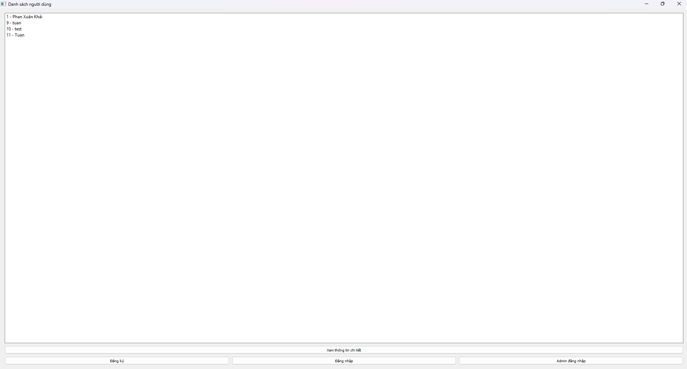

# Ứng dụng Triple DES và AES để bảo vệ thông tin nhạy cảm trong cơ sở dữ liệu
<div align="center">
<p align="center">
  
</p>
</div>

## 📝 Giới thiệu
Hệ thống lưu trữ thông tin người dùng, trong đó một số trường dữ liệu nhạy cảm sẽ được mã hóa bằng Triple DES hoặc AES nhằm đảm bảo an toàn và bảo mật khi lưu trữ

## ⚙️ Công nghệ sử dụng
- Python: Được dùng để xử lý logic, thuật toán mã hóa, quản lý dữ liệu, và điều khiển toàn bộ ứng dụng.
- PyQt5: Dùng để tạo các cửa sổ như: Đăng nhập, Đăng ký, Admin, Người dùng – giúp người dùng tương tác trực quan với hệ thống.
- SQLite: Dùng để lưu thông tin người dùng, dữ liệu đã mã hóa, và quản lý tài khoản một cách đơn giản.
- PyCryptodome (AES, Triple DES): Cung cấp các thuật toán bảo mật như AES và Triple DES, dùng để mã hóa/giải mã các thông tin nhạy cảm như CCCD, địa chỉ, số tài khoản,...

## 📁 Cấu trúc thư mục dự án
```
AnToanBaoMatThongTin/
├── crypto/
│   ├── aes_cipher.py              # Thuật toán mã hóa AES
│   └── triple_des_cipher.py       # Thuật toán mã hóa Triple DES
│
├── data/
│   └── users.db                   # Cơ sở dữ liệu SQLite lưu thông tin người dùng
│
├── GUI/
│   ├── admin_panel.py             # Giao diện quản trị viên
│   ├── login_window.py            # Giao diện đăng nhập
│   ├── public_view.py             # Giao diện người dùng sau đăng nhập
│   ├── register_window.py         # Giao diện đăng ký
│   └── user_profile.py            # Giao diện hồ sơ cá nhân
│
├── logs/
│   ├── access.log                 # File ghi log truy cập
│   └── access.py                  # Module xử lý ghi log
│
├── database.py                    # Kết nối và thao tác với SQLite
├── main.py                        # Tệp khởi chạy chính của chương trình
````

## 🚀 Cách chạy chương trình
```bash
# Clone repo
git clone https://github.com/phankhai04112004/secure-sensitive-data

# Cài thư viện
pip install -r requirements.txt

# Chạy chương trình
python main.py
```
<div align="center">
<p align="center">
  
</p>
</div>

## Sử dụng chương trình
👤 Người dùng:
Mở giao diện chương trình.

- Nhấn "Đăng ký" để tạo tài khoản mới.

- Sau khi đăng ký, sử dụng "Đăng nhập" để truy cập hệ thống.

- Nhập các thông tin cá nhân (CCCD, địa chỉ, tài khoản, BHXH) → dữ liệu sẽ tự động được mã hóa trước khi lưu.

- Có thể xem lại thông tin của mình (sau khi giải mã tự động khi đăng nhập thành công).

👮‍♂️ Quản trị viên:
Đăng nhập bằng tài khoản admin mặc định.

- Xem danh sách người dùng.

- Xóa người dùng.

- Kiểm tra file log truy cập từ logs/access.log.

## Cách kiểm tra bảo mật:
- Mở file data/users.db bằng DB Browser hoặc SQLite Viewer → bạn sẽ thấy dữ liệu đã được mã hóa (không thể đọc trực tiếp).

- Kiểm tra các bản ghi log trong logs/access.log để theo dõi các hành vi người dùng.
